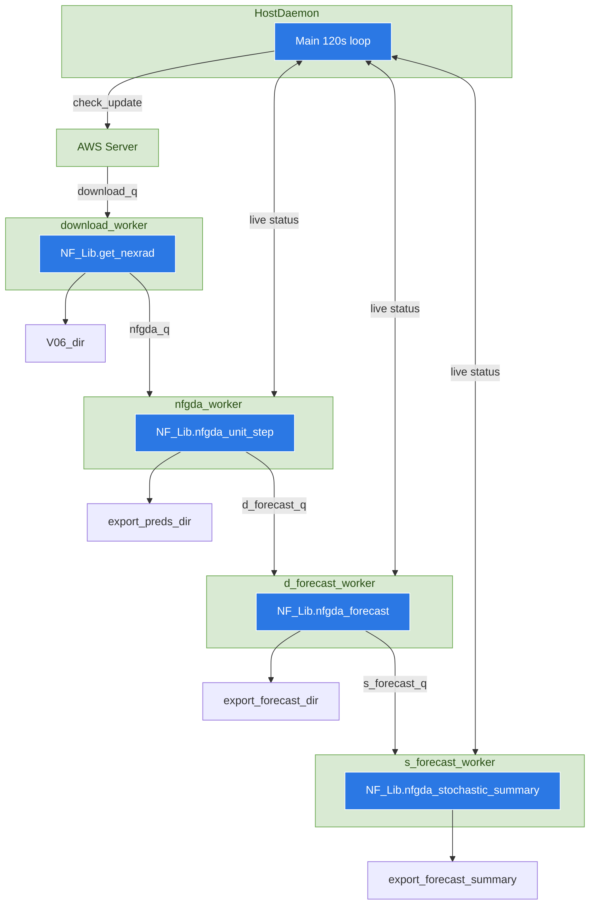

# NFGDA (Neuro-Fuzzy Gust Front Detection Algorithm)

This repository provides tools and scripts for the **Neuro-Fuzzy Gust Front Detection Algorithm** (NFGDA). Follow the instructions below to set up and run the system.

## Setup Instructions

### 1. Clone the repository

```bash
git clone https://github.com/firelab/NFGDA.git
cd NFGDA
```

### 2. Set up venv

Create and activate a virtual environment, then install dependencies:

```bash
# (Optional) deactivate any existing virtual environment
deactivate

# Create a new virtual environment
python3.12 -m venv ~/nfgda

# Activate the virtual environment
source ~/nfgda/bin/activate

# Install the package in editable mode
# This step may take a long time (more than 10mins) when using WSL due to dependency builds
python -m pip install -e .
```

### 3. (Optional) Configure for an event or a different radar site

Edit the `scripts/NFGDA.ini` to select the radar site and time range.

#### Real-time forecasting

```ini
radar_id = KABX
custom_start_time = None
custom_end_time =   None
```

#### Historic event analysis
```ini
radar_id = KABX
custom_start_time = 2020,07,07,01,22,24
custom_end_time =   2020,07,07,03,48,02
```
#### Configure output and runtime directories
```ini
export_preds_dir     = ./runtime/nfgda_detection/
export_forecast_dir  = ./runtime/forecast/
V06_dir              = ./runtime/V06/
```

### 4. Run NFGDA Server

```bash
cd scripts
# Must be run from the scripts directory.
# NFGDA_Host.py expects NFGDA.ini to be present in the current working directory.
python NFGDA_Host.py
```

---
<div style="page-break-after: always;"></div>


# Developer Guide

## Overview
The Neuro-Fuzzy Gust Front Detection Algorithm (NFGDA) system is an operational real-time processing framework that ingests Next-Generation Radar (NEXRAD) WSR-88D Level-II data to automate the identification and tracking gust front boundaries. This project extends the original NFGDA framework from a detection-only algorithm to an short-term forecasting pipeline. The system optimizes the computational execution speed of NFGDA for real-time processing and estimates frontal boundary motions based on sequential detection across temporal steps. The system provides detection of current gust fronts and short-term ensemble forecasting for wind shift warnings to support active wildfire situational awareness.

## Repository Structure
* [**`nfgda/`**](nfgda/): The major active Python library housing core algorithmic logic, membership functions, and workspace configuration utilities.
* [**`scripts/`**](scripts/): Contains operational deployment code, including the real-time execution host daemon and initialization configurations.
* [**`python/`**](python/): A legacy archive preserving original development and experimental scripts, prototyping files, and baseline validation workflows.
* [**`matlab/`**](matlab/): A legacy archive preserving the original algorithm prototyping and verification routines implemented in MATLAB.

## Server Pipeline
The real-time processing pipeline is implemented through a centralized host daemon [`scripts/NFGDA_Host.py`](scripts/NFGDA_Host.py). This daemon serves as an architectural blueprint establishing how functional routines inside [`nfgda/NF_Lib.py`](nfgda/NF_Lib.py) interact, as well as enforcing their sequence dependencies. While this sequence must be maintained, the underlying implementation can be migrated in the future to better align with web-server architectures.

The server initializes by loading a configuration file for the target monitoring radar. Following initialization, the system runs a single main control loop that manages four concurrent processing threads. Each worker thread consumes its own dedicated queue and executes a target processing function, while all threads share access to a single, localized active memory buffer to manage runtime states and data flows.



### **Initialization and Configuration Loading**

To support scenarios where multiple server instances run concurrently to monitor different NEXRAD radars, configuration files are used to control runtime directories and specify the `radar_id`.  
Configuration loading is handled by [`nfgda/NFGDA_load_config.py`](nfgda/NFGDA_load_config.py). By default, the system looks for [`scripts/NFGDA.ini`](scripts/NFGDA.ini), but you can override this using CLI arguments:  
```bash
python NFGDA_Host.py --conf NFGDA-[radar1].ini 
python NFGDA_Host.py --conf NFGDA-[radar2].ini
```
These configuration settings are used to create the database for intermediate processing products. The relative storage paths for these outputs are dynamically managed within `nfgda/nf_path.py`(nfgda/nf_path.py).

### **Main Loop**
The Main Host Loop acts as an automated background thread running at a fixed 2-minute frequency. It continually queries the Amazon Web Services (AWS) NEXRAD public cloud data repository to check for new volume updates for the target radar station.
This polling sequence invokes the function [**NF_Lib.aws_int.get_avail_scans_in_range**](https://github.com/firelab/NFGDA/blob/60728fb/scripts/NFGDA_Host.py#L75-77)(start_datetime, end_datetime, radar_id)

The function returns a list of available NEXRAD file strings. These filenames are immediately assigned to the `download_q` for the `download_worker`.

### **Worker threads**
Once the Main Host Loop identifies available data, the pipeline hands off execution to four concurrent, thread-isolated worker processes. While these workers run concurrently, they maintain clear upstream-to-downstream data dependencies managed via queues and state readiness flags.

**Download Worker (`download_worker`)**: 
consumes the inbound queue (`download_q`).
>* **Download data from Cloud server**: It executes  [`NF_Lib.get_nexrad`](https://github.com/firelab/NFGDA/blob/60728fb/nfgda/NF_Lib.py#L326) to request NEXRAD Level-II volume files from the AWS repository into the local database (`V06_dir` in `NFGDA.ini`). If the function identifies that the target file already exists in the local database, it automatically skips the download to preserve network bandwidth.
>* **Cartesian Gridding Preprocessing**: Immediately following file verification or download completion, the Level-II data is converted into a radar-centered Cartesian coordinate system. The intermediate Cartesian arrays are stored as .npz files in the `V06_dir/npz` directory.
>* **Downstream Hand-off**: Once coordinate conversion finishes, the thread pushes the completed filename string to the `nfgda_q` queue and updates the state tracker by setting the corresponding `nfgda_ready` status flag to True.

**Detection Worker (`nfgda_worker`)**:
consumes the converted Cartesian files passed into the `nfgda_q` queue to perform core neuro-fuzzy boundary extractions. 
>* **Search for Time Sequence**: The NFGDA requires a minimum of two consecutive radar scans to proper detecting the moving boundary, the worker checks the `nfgda_ready` status flags across sequential time steps. 
>* **Core Detection Routine**: Once two consecutive steps are verified ready, the thread runs the core algorithm: [`NF_Lib.nfgda_unit_step`](https://github.com/firelab/NFGDA/blob/60728fb/nfgda/NF_Lib.py#L170)(self.live_nexrad[pre_idx], self.live_nexrad[idx])
>Where `self.live_nexrad[pre_idx]` represents the previous scan filename and `self.live_nexrad[idx]` represents the current scan filename.
>* **Output files and Downstream Hand-off**:Upon completing the boundary extraction, the tracking reset `nfgda_ready` status flag for the historical step, and the df_ready status flag is set to signal readiness for the downstream forecasting thread. Output files(.npz and .tif) are automatically saved to the `export_preds_dir` directory specified in `NFGDA.ini`.

**Deterministic Forecast Worker (`d_forecast_worker`)**: 
consumes the detection products via the `d_forecast_q` queue to perform front motion estimation.
>* **Prediction Pipeline**: The worker executes [`NF_Lib.nfgda_forecast`](https://github.com/firelab/NFGDA/blob/60728fb/nfgda/NF_Lib.py#L865), ingesting two consecutive detection steps (self.live_nexrad[idx] and self.live_nexrad[next_idx]) to build motion anchors. The control vector is saved to `export_forecast_dir` and buffer in memory for forecast worker sythesis the proxy.
>* **Algorithmic Logic and Data Geometry**:  
>**DataGFG Initialization**: A specialized instance of the `GFGroups` class, DataGFG ingests a raw 2D matrix mask (‘nfout’) of gust front boundary structures, and converts the raster coordinates into vector representations (anchors).  
>**update_velocitys(0)**: Executes spatial association routines between the two consecutive scans to estimate motion vectors.
>**prediction(0, dt)**: Projects the tracking vector forward to generate a new calculated GFGroups object at incremental time steps (‘dt’).  
>**GFGroups Class**: Acts as the primary structural data holder for gust front line anchor nodes. It can rasterize anchors back into dense line using `self.anchors_to_arcs()` or into 2D binary mask using `self.anchors_to_arcs_map()`.

**Stochastic Forecast Worker (`s_forecast_worker`)**:
consumes the tracking vectors from the `s_forecast_q` queue. It summarizes independent deterministic forecast into unified spatial probability maps. 
>**Integration and Weighting Routine**: The thread loops over the running cache of deterministic predictions to compile a single probability density field. The core integration logic is 
at [nfgda/NF_Lib.py](https://github.com/firelab/NFGDA/blob/60728fb/nfgda/NF_Lib.py#L1056-1061).  
>**Probability Mapping**: For each overlapping validation window (`valid_time`), the worker applies a time-decaying exponential weight (`exp_weight`) based on the forward projection duration (dt). The vector arcs from the `GFGroups` container are rasterized via `anchors_to_arcs_map()`, smoothed using a morphological disk dilation radius and accumulated into a gridded array.  
>**Operational Deliverable**: The final output is exported as a 2D stochastic proxy map representing localized gust front placement probabilities. While these continuous probability matrices can be post-processed back into hard vector paths, preserving the gridded raster data is highly recommended for web interface plotting, as it mathematically preserves the spatial uncertainty generated by divergent tracking ensembles.

---

## Core Data Structures
The NFGDA pipeline records five datasets throughout its processing cycle:

* A local storage copy of the raw, polar-coordinate NEXRAD Level-II radar volumes. 
* A coordinate-converted (Cartesian) version of the radar data optimized for NFGDA detection inputs. 
* The NFGDA detection outputs alongside processed input parameters, formatted as arrays and GeoTIFFs for the USFS web interface. 
* Intermediate gust front vector logs of deterministic forecasting sequence. 
* An aggregated ensemble probability proxy map highlighting expected gust front location.

### NEXRAD Level-II Base Data (saved in `V06_dir`)
Data ingestion, parsing, and base file reads within this directory can be managed using standard atmospheric community libraries, specifically the Python ARM Radar Toolkit ([Py-ART](https://arm-doe.github.io/pyart/)).

### NFGDA Input Data (saved in `V06_dir/npz`)
Stored as `.npz`. These files serve as the direct, gridded Cartesian ingestion source consumed by the primary detection routine `NF_Lib.nfgda_unit_step`.

The dataset archive maps three dictionary keys:
* `timestamp`: A native `np.datetime64` timestamp.
* `mask`: A 2D binary coordinate mask used to exclude corrupted cells and out-of-range grid points.
* `PARROT`: A 3D data cube matrix with a structural shape of `[401, 401, 6]`, where coordinates map along the standard `[X, Y, Variable]` Cartesian planimetric grid. 

The 6 structural channels correspond to the following base radar variables:
* `PARROT[:, :, 0]` = Reflectivity
* `PARROT[:, :, 1]` = Radial Velocity
* `PARROT[:, :, 2]` = Spectrum Width
* `PARROT[:, :, 3]` = Differential Phase
* `PARROT[:, :, 4]` = Cross-Correlation Ratio
* `PARROT[:, :, 5]` = Differential Reflectivity

### NFGDA Detection Output Data (saved in `export_preds_dir`)

#### `.npz` format
The primary dictionary archive maps the following operational keys:
* `timestamp`: A native `np.datetime64` timestamp. 
* `nfout`: A 2D binary mask matrix `[401, 401]` representing the raster result of the NFGDA detection. `1` indicates a confirmed gust front boundary pixel, while `0` denotes background cells. 
* `inputNF`: A 3D analytical input data cube with a shape of `[401, 401, 6]`. This array captures the preprocessed outputs of the fuzzy logic fuzzification membership layer. 

> **Note**: The variable channels contained in `inputNF` differ from the raw base arrays mapped within the `PARROT` cube and are indexed as follows: 
> * `inputNF[:, :, 0]` = beta (functional template parameter)
> * `inputNF[:, :, 1]` = Reflectivity
> * `inputNF[:, :, 2]` = Cross-Correlation Ratio
> * `inputNF[:, :, 3]` = Differential Reflectivity
> * `inputNF[:, :, 4]` = Velocity Texture (spatial standard deviation of velocity)
> * `inputNF[:, :, 5]` = Differential Phase Shift

#### `GeoTIFF` format
The container maps the `inputNF` data cube directly into separate spectral image bands, swapping the native X and Y spatial axes `[X, Y, Variable]` to conform to a standard row-column image coordinate system `[Y, X, band]`.

The binary edge detection (`nfout`) is stored in the **seventh** band.

### Intermediate Gust Front Forecasting Data (saved in `export_forecast_dir`)
The motion vectors of gust front forecasts managed by the `Prediction_Connection` class are stored as `.npz` resources and saved to `export_forecast_dir`. These vectors can be loaded using `Prediction_Connection.load(path)` and are used for proxy summarizing in the stochastic forecast worker.

### Gust Front Ensemble Proxy Data (saved in `export_forecast_dir/forecast-summary/`)
This is the final forecasting product exported by the system.

#### `.npz` format
The primary dictionary archive maps the following operational keys:
* `timestamp`: A native `np.datetime64` timestamp tracking the scan validation window. 
* `nfproxy`: A 2D float array `[401, 401]` of the gust front proxy.

#### `GeoTIFF` format
The GeoTIFF format only records the single-channel `nfproxy`.

## Visualization Example

An example of GeoTIFF visualization of the output can be found in [`scripts/plot_example`](scripts/plot_example).

It loads example datasets of detection and forecasts, showing basic overlays of reflectivity (shading), detection (binary raster), and the forecast (thresholded contour).

---

## NFGDA Detection and Prediction Tuning

### NFGDA Detection Parameters
The performance, sensitivity, and extraction accuracy of the NFGDA detection engine depend heavily on the tuning of two primary underlying parameters:

* **Functional Template Correlation (FTC)**: The primary method for optimizing or altering active gust front boundary sensitivity is managed by tuning the FTC equations.  
  * Located in [`nfgda/NF_Lib.py`](https://github.com/firelab/NFGDA/blob/60728fb/nfgda/NF_Lib.py#L247-L257).
  * Visual verification tools and plotting utilities designed to analyze FTC scoring adjustments can be found in the legacy archive file `python/FTC_improve.ipynb`. However, because the core system has gone through a long, rolling development cycle, there is a high risk of script incompatibility.

* **Membership Functions and Fuzzy Inference System (FIS)**:  
  * The FIS is stored in `nfgda/NF00ref_YHWANG_fis4python.mat` and loaded by the custom module [`NFModule`](https://github.com/firelab/NFGDA/blob/60728fb/nfgda/NF_Lib.py#L168)).
  * The native membership properties and fuzzy logic profiles were originally generated using the MATLAB Fuzzy Logic Toolbox utility (`genfis`). These matrices were subsequently exported and parsed into a Python-compatible structure using the conversion script `matlab/fis2python.m`.
  * **Warning**: This multi-dimensional membership parameter set is mathematically hyper-sensitive. Slight changes to individual fuzzy weights can destabilize the edge-detection logic and cause the system's array boundaries to collapse. Consequently, it is strongly recommended that developers do not modify or fine-tune this data layer, focusing optimization efforts exclusively on the FTC function parameters.


### Forecast Proxy Weighting
The generation of the final ensemble probability map is controlled by a set of time constants that balance historical projections within a rolling window.

In the current repository iteration, the time constants (`ele_t_const` and `mean_t_const`) and their associated exponential decay functions (`exp_weight`) are hard-coded in `nfgda/NF_Lib.py`.

These hard-coded values should be updated after a structured performance evaluation. This requires evaluating the operational performance of the integrated pipeline over a longer deployment period to minimize false alarm rates and optimize spatial probability envelopes. For the original baseline testing and initial verification results, developers can consult the team's published IEEE RadarConf’26 paper, *"Toward a Real-Time Gust Front Prediction for Wildfire Hazard Awareness Using Polarimetric Weather Radar"*. This publication provides the statistical foundation for the current parameter values and serves as a performance benchmark for future ensemble optimization cycles.
