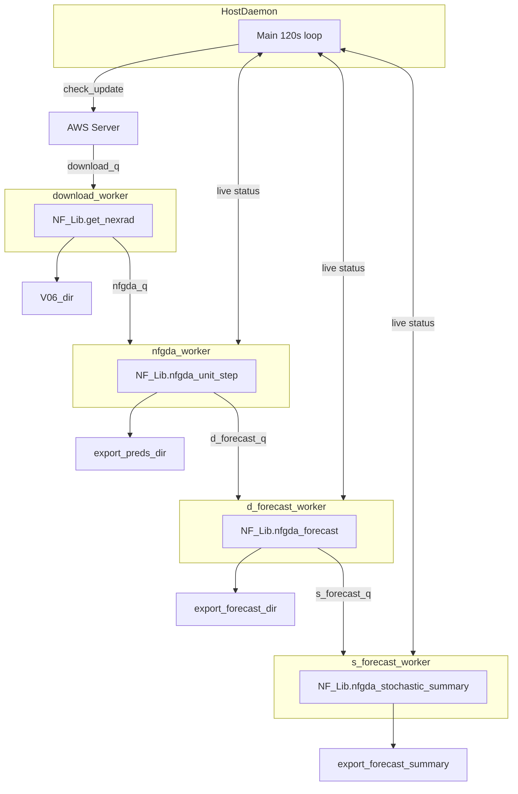

# NFGDA (Neuro-Fuzzy Gust Front Detection Algorithm)

This repository provides tools and scripts for the **Neuro-Fuzzy Gust Front Detection Algorithm** (NFGDA). Follow the instructions below to set up and run the system.



## Setup Instructions

### 1. Clone the repository

```bash
git clone https://github.com/firelab/NFGDA.git
cd NFGDA
```

### 2. Set up venv

Create and activate a virtual environment, then install dependencies:

```bash
# (Optional) deactivate any existing virtual environment
deactivate

# Create a new virtual environment
python3.12 -m venv ~/nfgda

# Activate the virtual environment
source ~/nfgda/bin/activate

# Install the package in editable mode
# This step may take a long time (more than 10mins) when using WSL due to dependency builds
python -m pip install -e .
```

### 3. (Optional) Configure for an event or a different radar site

Edit the `scripts/NFGDA.ini` to select the radar site and time range.

#### Real-time forecasting

```ini
radar_id = KABX
custom_start_time = None
custom_end_time =   None
```

#### Historic event analysis
```ini
radar_id = KABX
custom_start_time = 2020,07,07,01,22,24
custom_end_time =   2020,07,07,03,48,02
```
#### Configure output and runtime directories
```ini
export_preds_dir     = ./runtime/nfgda_detection/
export_forecast_dir  = ./runtime/forecast/
V06_dir              = ./runtime/V06/
```

### 4. Run NFGDA Server

```bash
cd scripts
# Must be run from the scripts directory.
# NFGDA_Host.py expects NFGDA.ini to be present in the current working directory.
python NFGDA_Host.py
```
